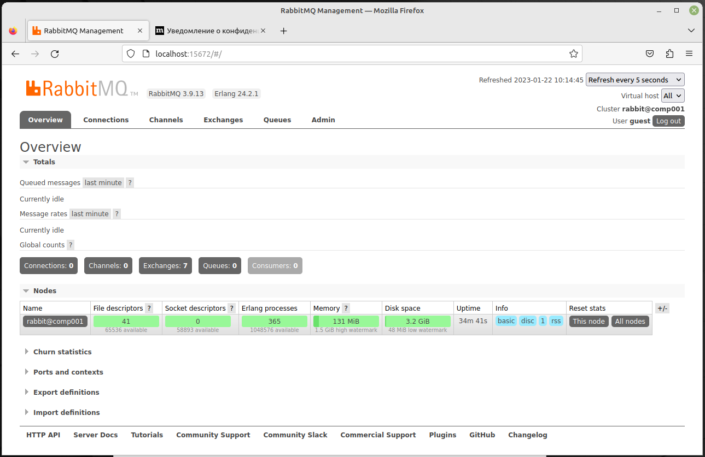
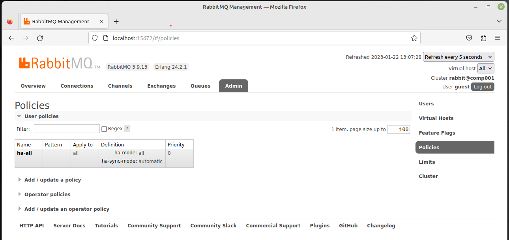
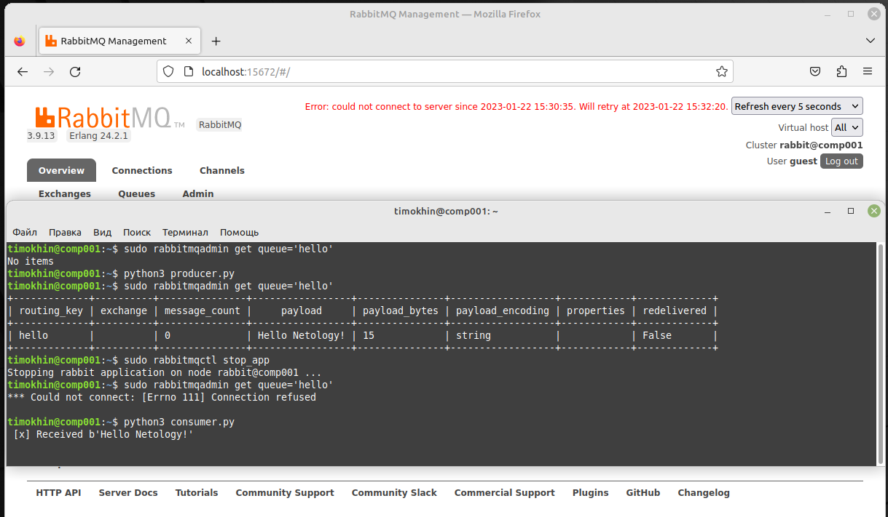

# Домашнее задание к занятию "Очереди RabbitMQ" - `Тимохин Виталий`

### Задание 1.  Установка RabbitMQ.

Используя Vagrant или VirtualBox, создайте виртуальную машину и установите RabbitMQ. Добавьте management plug-in и зайдите в веб-интерфейс.
Итогом выполнения домашнего задания будет приложенный скриншот веб-интерфейса RabbitMQ.

`Cкриншот веб-интерфейса RabbitMQ`



### Задание 2. Отправка и получение сообщений.

Используя приложенные скрипты, проведите тестовую отправку и получение сообщения. Для отправки сообщений необходимо запустить скрипт producer.py.
Для работы скриптов вам необходимо установить Python версии 3 и библиотеку Pika. Также в скриптах нужно указать IP-адрес машины, на которой запущен RabbitMQ, заменив localhost на нужный IP.
$ pip install pika
Зайдите в веб-интерфейс, найдите очередь под названием hello и сделайте скриншот. После чего запустите второй скрипт consumer.py и сделайте скриншот результата выполнения скрипта
В качестве решения домашнего задания приложите оба скриншота, сделанных на этапе выполнения.

`Cкриншот веб-интерфейса RabbitMQ после выполнения скрипта producer.py`


`Cкриншот выполнения скрипта consumer.py`


### Задание 3. Подготовка HA кластера.

Используя Vagrant или VirtualBox, создайте вторую виртуальную машину и установите RabbitMQ. Добавьте в файл hosts название и IP-адрес каждой машины, чтобы машины могли видеть друг друга по имени.
Пример содержимого hosts файла:
$ cat /etc/hosts
192.168.0.10 rmq01
192.168.0.11 rmq02
После этого ваши машины могут пинговаться по имени.
Затем объедините две машины в кластер и создайте политику ha-all на все очереди.
В качестве решения домашнего задания приложите скриншоты из веб-интерфейса с информацией о доступных нодах в кластере и включённой политикой.

`Cкриншот веб-интерфейса RabbitMQ с информацией о доступных нодах в кластере`


`Cкриншот веб-интерфейса RabbitMQ с информацией о включенной политике`



Также приложите вывод команды с двух нод:
$ rabbitmqctl cluster_status

`Cкриншоты вывода команды rabbitmqctl cluster_status с двух нод`


Для закрепления материала снова запустите скрипт producer.py и приложите скриншот выполнения команды на каждой из нод:
$ rabbitmqadmin get queue='hello'
После чего попробуйте отключить одну из нод, желательно ту, к которой подключались из скрипта, затем поправьте параметры подключения в скрипте consumer.py на вторую ноду и запустите его.

`Поправленный скрипт сonsumer.py:`

```python
#!/usr/bin/env python
# coding=utf-8
import pika
credentials = pika.PlainCredentials('test', 'test')
connection = pika.BlockingConnection(pika.ConnectionParameters('comp002', 5672,'/', credentials))
channel = connection.channel()
channel.queue_declare(queue='hello')

def callback(ch, method, properties, body):
    print(" [x] Received %r" % body)

channel.basic_consume(queue='hello', on_message_callback=callback, auto_ack=True)

channel.start_consuming()
```
Приложите скриншот результата работы второго скрипта.

`Скриншот результата работы поправленного скрипта сonsumer.py:`



